# Desafio de Backend Java Pleno com Spring Boot: Sistema de Notificações

## 📚Informação do Sistema👨‍🏫👩‍🎓
O sistema em questão é um gerenciador de notificações onde o usuário logado na aplicação, consegue enviar mensagens para outro usuário também registrado.

<h3>Funcionalidade do Usuário<br> </h3>   
 
+ Registrar notificação.<br>
+ Atualizar notificação como lida.<br>
+ Listar notificação.<br>

## Implementações adicionais
<h3>Funcionalidade do Administrador<br></h3>

+ Registrar Usuário.<br>
+ Agendar envio de e-mail.<br>
+ Enviar e-mail.<br>

No tocante a funcionalidade de agendamento de envio de e-mail, foi utilizando para a sua implementação o JavaMailSender. Partindo da premissa de que é de grande relevância contactar os usuários de forma específica, seja com comunicados de manutenção, informações de atualizações ou novas implementações. 
Ainda referente a funcionadade de envio de e-mail no que se trata da automatização dos agendamentos, foi utilizado o ferramenta scheduled job que instância um serviço a cada minuto para consultar o banco de dados, validando as mensagens com status "agendada" e verificando se o horário de envio já passou, para então enviá-las.

## Arquitetura Software💻
O projeto foi desenvolvido utilizando o padrão API RESTful, que segue os princípios da arquitetura REST (Representational State Transfer). A aplicação foi estruturada para permitir a comunicação eficiente entre o cliente e o servidor, utilizando métodos HTTP como GET, POST, PUT e DELETE para gerenciar recursos. 

## Segurança 🔐
O sistema de segurança utilizando na implementação foi o Spring Security para facilitar a autenticação e autorização. O método de autenticação escolhido foi o JSON Web Token (JWT), e todas as rotas, exceto as de acesso público, devem exigir esse método de autenticação. Além disso, foi utilizado o BCrypt para criptografar as senhas dos usuários, garantindo que, mesmo que o banco de dados seja violado, as credenciais de acesso ainda estarão seguras.

## Conteinerização da aplicação 🐳
O sistema foi conteinizado utilizando o Docker com o objetivo de evitar conflitos e tornar o ambiente mais intuitivo para outros desenvolvedores. 

<h3>Sistemas dentro do container</h3>

## PhpMyadmin
O phpMyAdmin é uma ferramenta de gerenciamento de banco de dados que permite visualizar e manipular dados armazenados de forma prática e intuitiva.
```
Rota de acesso:http://localhost:8000/

Crendenciais de Acesso

usuario:root

senha:java
```

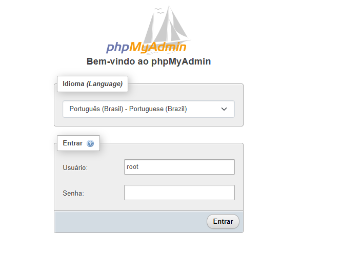

Esta imagem mostra o sistema interno do SGBD (Sistema de Gerenciamento de Banco de Dados).


## Mysql
Configurações do Mysql

```
versao:mysql:8.0.31

porta:3306:3306

MYSQL_DATABASE: db_mv

MYSQL_ROOT_PASSWORD: java
```

## Prometheus
O Prometheus é utilizado para capturar, armazenar e consultar métricas do sistema em tempo real.

```
Rota de acesso:http://localhost:9090
```
Imagem da interface do sistema interno do Prometheus

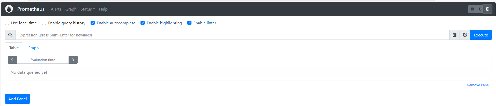

A consulta de métricas é realizada clicando no ícone do globo

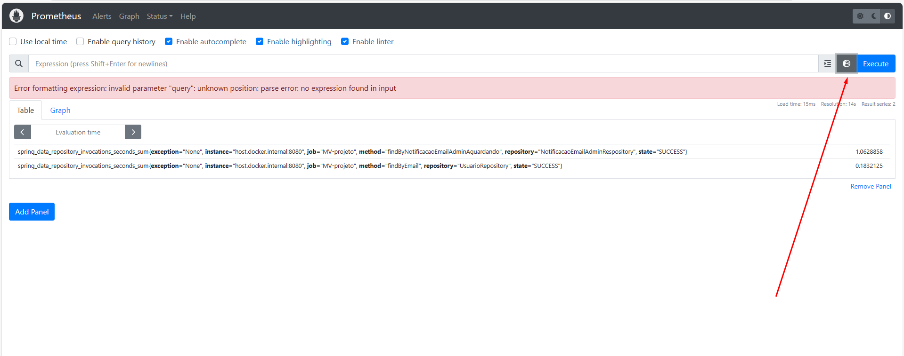

É apresentada uma lista de métricas que podem ser executadas para obter os resultados desejados. Escolha uma métrica e, em seguida, execute-a para visualizar as métricas registradas

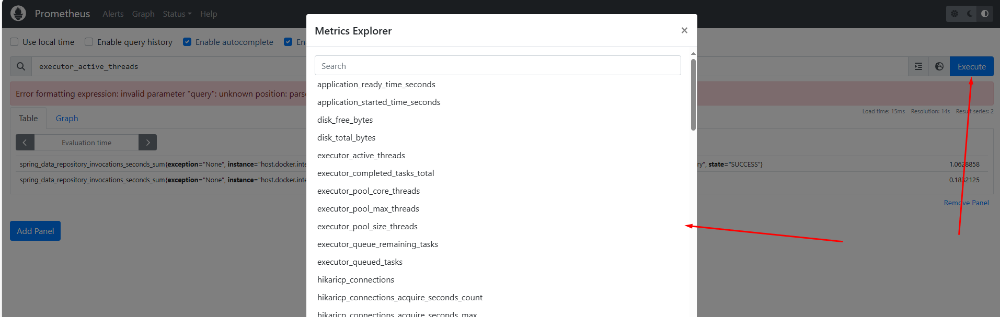

O resultado da consulta é apresentado dessa maneira.

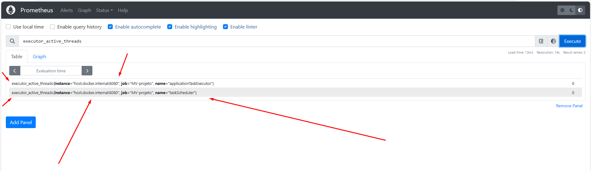

## Grafana

O Grafana utiliza as métricas coletadas pelo Prometheus e as exibe em um dashboard intuitivo e visualmente atraente, facilitando a análise e o monitoramento dos dados.

```
Rota de acesso:: http://localhost:3000/login

Crendenciais de Acesso

usuario:admin

senha:testePlenoMV
```
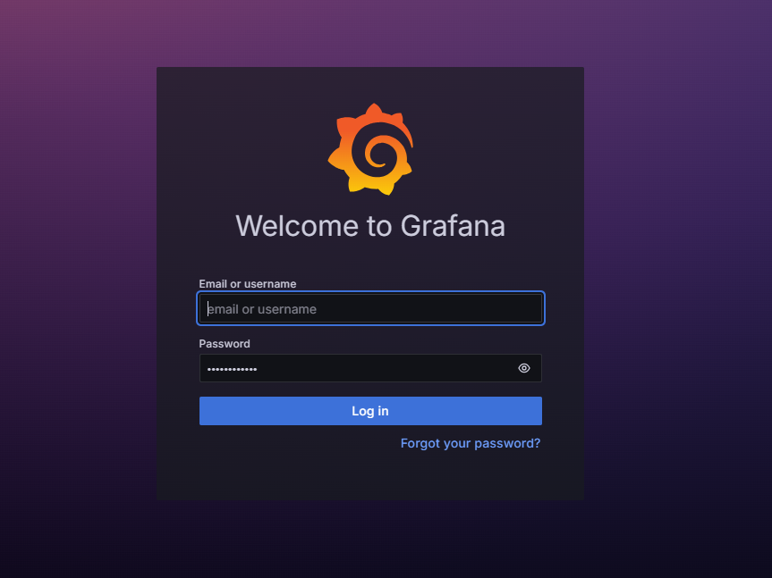

Clicando na opção menu "Dashboard", exibirá um modelo de apresentação ao qual será aplicado.

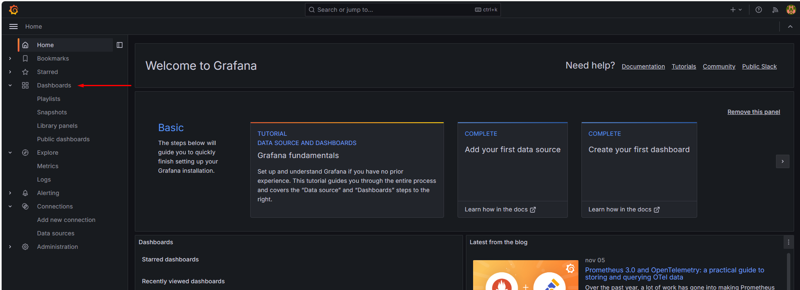

Clicando no modelo em questão: "spring boot statistics & endpoint metrics".

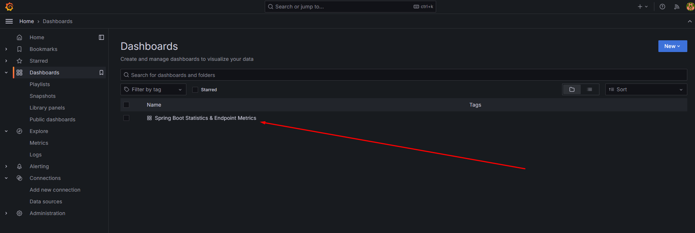

O dashboard será apresentado desta maneira:

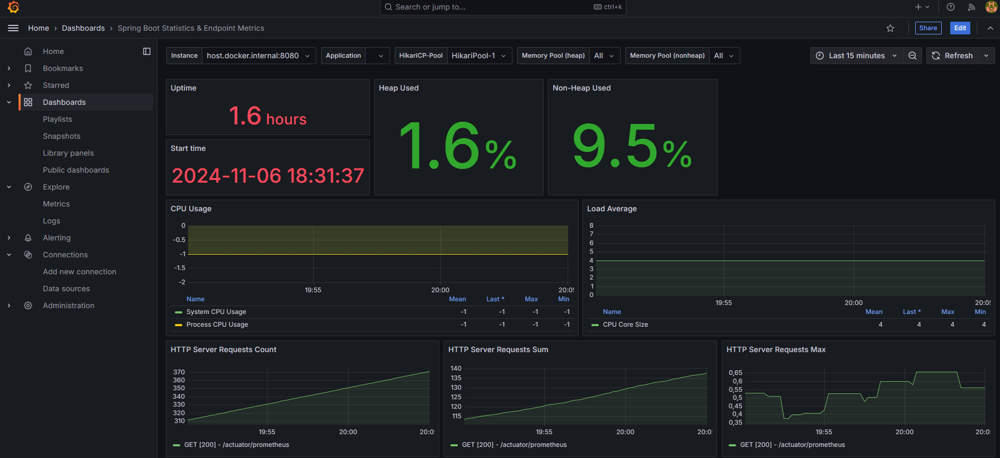

## Inicialização aplicação

```
 docker-compose up --build -d
```

## Informações de Acesso
O acesso é realizado usando e-mail e senha. Quando a aplicação é inicializada, um usuário administrador é registrado automaticamente, com permissões para registrar outros usuários.

Vale salientar que a inicialização do usuário administrador é totalmente segura, pois ele é registrado com uma senha criptografada, como é demostrando na imagem abaixo.

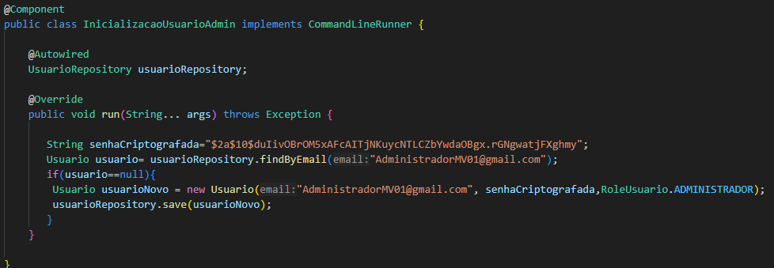

```
crendenciais de acesso

Email:AdministradorMV01@gmail.com

Senha:testePlenoMV
```
## Documentação da API com Swagger

O sistema utiliza o Swagger para documentar todas as rotas da API, fornecendo uma interface de usabilidade intuitiva. Essa interface exibe automaticamente um JSON predefinido para cada rota, facilitando a interação e o teste das APIs diretamente na área compartilhada por eles.
```
Rota de acesso: http://localhost:8080/swagger-ui/index.html
```
Essa é a interface gráfica do Swagger

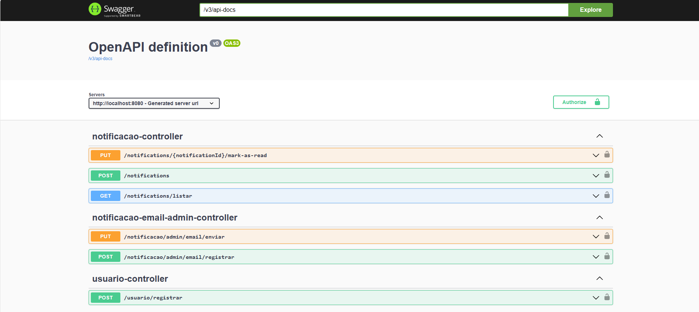

O sistema requer um token para acessar as rotas, por isso é necessário fazer o login na aplicação para obter o token que será utilizado nas rotas que exigem autenticação.

Siga o passo a passo demostrado para realizar o login.

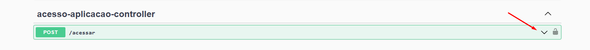

Clique na opção "Try in out" para implementar os dados que serão utilizados na requisição de login.

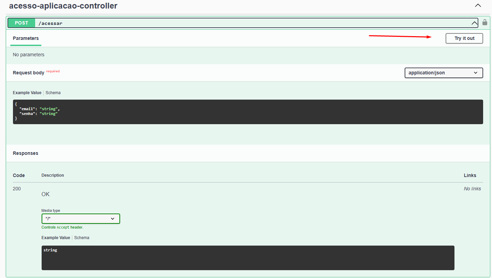

Implemente os dados conforme demonstrado na imagem abaixo e execute a requisição.

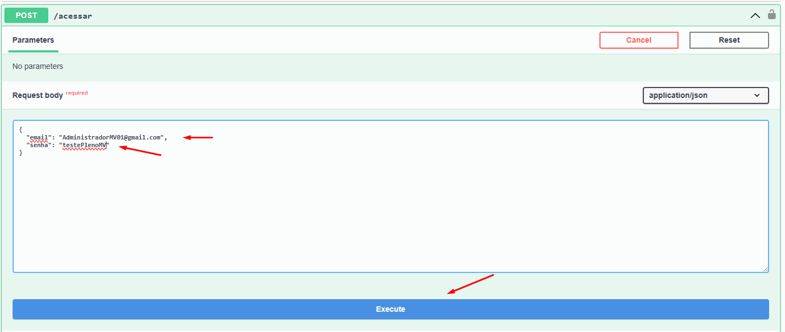

Copie o token recebido na imagem abaixo e utilize-o na aplicação.

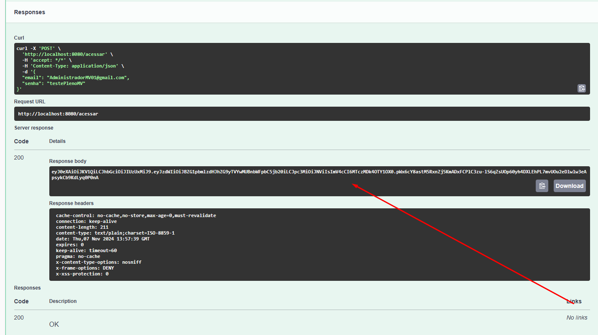

O token deve ser registrado no Swagger para todas as requisições, conforme demonstrado na imagem.

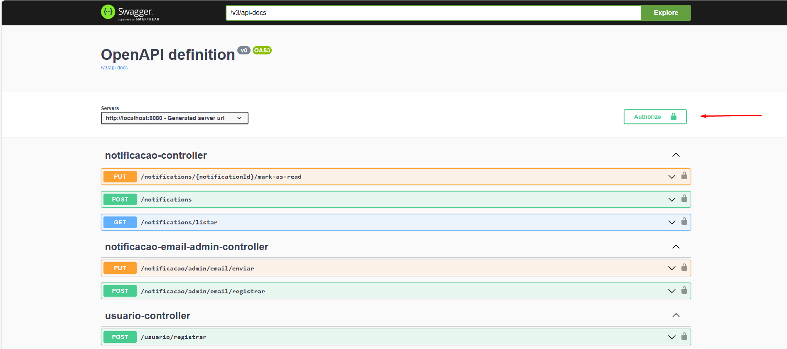

Implemente o token no campo indicado e clique em "Authorize".

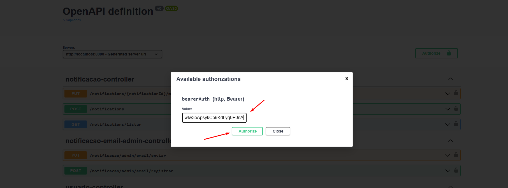

Após implementar o token, feche a janela clicando no "X", conforme demonstrado na imagem.

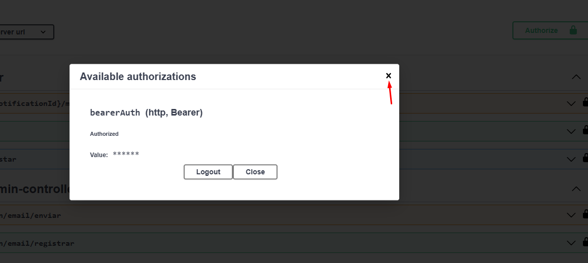

Com a conclusão desse passo a passo, todas as rotas que necessitam de token funcionarão corretamente.Como comprovado na imagem. 

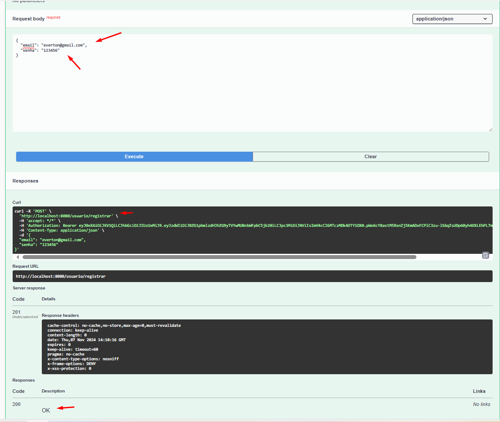
